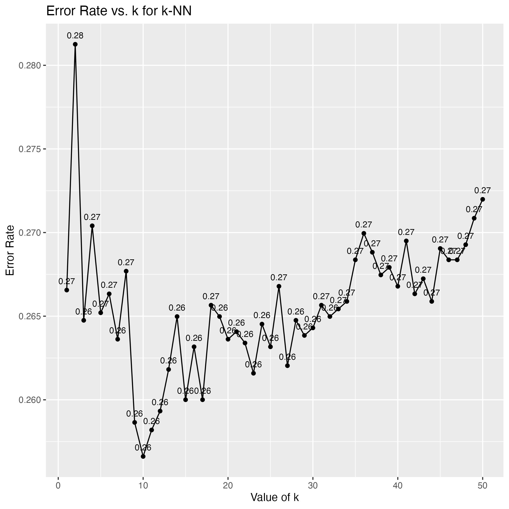
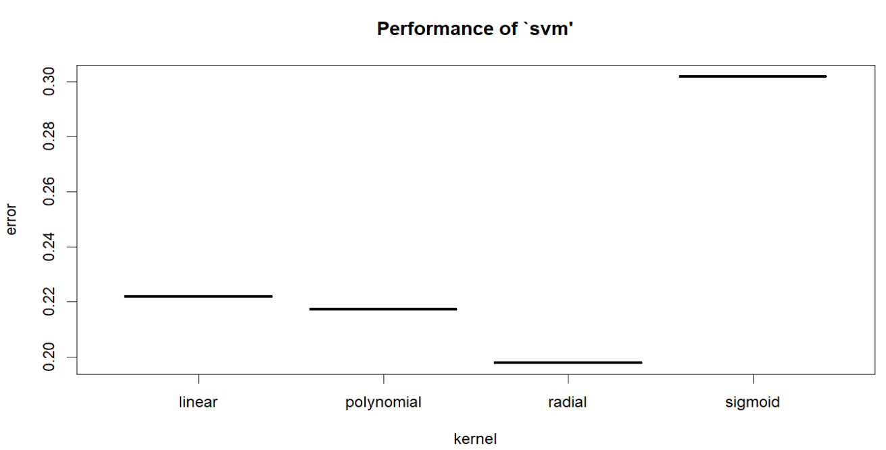

------------------------------------------------------------------------

\newpage

```{r setup, include=FALSE}
knitr::opts_chunk$set(echo = TRUE)
library(randomForest)
library(tree)
library(car)
library(glmnet)
library(e1071)
library(stringr)
library(class)
library(ISLR2)
library(MASS, exclude='select')
library(tidyverse)
library(dplyr)
library(class)
library(knitr)
# to make sure dplyr's select function get called when select instead of MASS
select <- dplyr::select
```

**Table 1:** 
<table>

Name                                   course
-------------                        ---------
Dhruv Jain                            Data -627
Venkata Dhanush Kikkisetti            Data -627
Sunday                                Data -627
Meckdim                               Data -627

</table>

```{r echo=FALSE, message=FALSE, warning=FALSE}
airbnb<-read_csv("Airbnb.csv")

## Lets first get rid of the text's, URLS and few details about host.
airbnb%>%
  select(-c('name','description','neighborhood_overview','picture_url','host_url','host_about',
            'host_verifications','neighbourhood','listing_url',
            'scrape_id','last_scraped','host_thumbnail_url','host_picture_url',
            'calendar_updated','bathrooms','license'))->airbnb


```

```{r echo=FALSE, message=FALSE, warning=FALSE}
# Let us take 70% the data for train and 30% for the test set. 
set.seed(1234)
Z <- sample(nrow(airbnb), .7* nrow(airbnb))
train <- airbnb[Z,]
test <- airbnb[-Z,]


```

```{r echo=FALSE, message=FALSE, warning=FALSE}

#Convert total amenities that are in text to total number of amenities in number.

train%>%
  mutate(amenities_count=str_count(amenities,',')+1)->train

test%>%
  mutate(amenities_count=str_count(amenities,',')+1)->test
```

```{r echo=FALSE, message=FALSE, warning=FALSE}
# we have to store it here. 
medianReviewScoresRating <- median(train$review_scores_rating,na.rm = TRUE)
train$review_scores_rating[is.na(train$review_scores_rating)]<-median(train$review_scores_rating,na.rm = TRUE)
test$review_scores_rating[is.na(test$review_scores_rating)]<-medianReviewScoresRating

```

```{r echo=FALSE, message=FALSE, warning=FALSE}
medianBedRooms <-  median(train$bedrooms, na.rm=TRUE )
train <- train %>% mutate(across(bedrooms, ~replace_na(., median(., na.rm=TRUE))))
test <- test %>% mutate(across(bedrooms, ~replace_na(., medianBedRooms)))

```

```{r echo=FALSE, message=FALSE, warning=FALSE}
MedianReviewsPerMonth <- median(train$reviews_per_month,na.rm = TRUE)
train$reviews_per_month[is.na(train$reviews_per_month)]<-median(train$reviews_per_month,na.rm = TRUE)
test$reviews_per_month[is.na(test$reviews_per_month)]<- MedianReviewsPerMonth

```

```{r echo=FALSE, message=FALSE, warning=FALSE}

train%>%
  filter(!is.na(beds) & !is.na(neighbourhood_group_cleansed)&!is.na(host_is_superhost)& !is.na(host_name) & !is.na(bathrooms_text))->train

test%>%
  filter(!is.na(beds) & !is.na(neighbourhood_group_cleansed)&!is.na(host_is_superhost)& !is.na(host_name) & !is.na(bathrooms_text))->test


#get rid of amenities as we transformed it into a new count variable and other variables that are not necessaary 
train%>%
  select(-c('id','source','amenities'))->train

test%>%
  select(-c('id','source','amenities'))->test


#there are still N/A in the response_rate variable and host_acceptance_rate, we have to convert datatype to int. 
```

```{r echo=FALSE, message=FALSE, warning=FALSE}

#parsing number
train$bathroom<-parse_number( train$bathrooms_text,na=c("",'NA','Shared half-bath','Half-bath','Private half-bath'))

test$bathroom<-parse_number( test$bathrooms_text,na=c("",'NA','Shared half-bath','Half-bath','Private half-bath'))

train%>%
  filter(!is.na(bathroom))->train

test%>%
  filter(!is.na(bathroom))->test

```

```{r echo=FALSE, message=FALSE, warning=FALSE}

# Saving the training into separate data frames for classification and regression. The classification team uses the train_cf and test_cf data frame and the regression team uses train_reg and test_reg.
train_cf <- train
train_reg <- train 

test_cf <- test
test_reg <- test

```

```{r echo=FALSE, message=FALSE, warning=FALSE}
train_cf$price<- parse_number(train_cf$price,na=c("",'NA')) 
test_cf$price<-parse_number(test_cf$price,na=c("",'NA'))
```

```{r echo=FALSE, message=FALSE, warning=FALSE}

#We can remove 'maximum_maximum_nights,minimum_maximum_nights,maximum_minimum_nights,minimum_minimum_nights' as they are computed as average minimum and maximum night values
train_cf%>%
  select(-c('maximum_maximum_nights','minimum_minimum_nights','maximum_minimum_nights','minimum_maximum_nights'))->train_cf

test_cf%>%
  select(-c('maximum_maximum_nights','minimum_minimum_nights','maximum_minimum_nights','minimum_maximum_nights'))->test_cf


```

```{r echo=FALSE, message=FALSE, warning=FALSE}
train_cf%>%
  select(-c('review_scores_accuracy','review_scores_cleanliness','review_scores_checkin','review_scores_location','review_scores_value','first_review','last_review','review_scores_communication'))->train_cf

test_cf%>%
  select(-c('review_scores_accuracy','review_scores_cleanliness','review_scores_checkin','review_scores_location','review_scores_value','first_review','last_review','review_scores_communication'))->test_cf


#Host location is not important either
train_cf%>%
  select(-c('host_location'))->train_cf

test_cf%>%
  select(-c('host_location'))->test_cf

```

```{r echo=FALSE, message=FALSE, warning=FALSE}
train_cf%>%
  select(-host_neighbourhood)->train_cf
test_cf%>%
  select(-host_neighbourhood)->test_cf

```

```{r echo=FALSE, message=FALSE, warning=FALSE}
train_cf%>%
  filter(host_response_rate!="N/A")->train_cf
train_cf%>%
  filter(host_acceptance_rate!="N/A")->train_cf
test_cf%>%
  filter(host_response_rate!="N/A")->test_cf

test_cf%>%
  filter(host_acceptance_rate!="N/A")->test_cf
```

```{r echo=FALSE, message=FALSE, warning=FALSE}

train_cf$host_response_rate<-parse_number(train_cf$host_response_rate,na=c("","NA"))
test_cf$host_response_rate<-parse_number(test_cf$host_response_rate,na=c("","NA")) 

train_cf$host_acceptance_rate<-parse_number(train_cf$host_acceptance_rate,na=c("","NA"))
test_cf$host_acceptance_rate<-parse_number(test_cf$host_acceptance_rate,na=c("","NA"))


train_cf$host_since<-parse_date(train_cf$host_since,format = "%d/%m/%y")
test_cf$host_since<-parse_date(test_cf$host_since,format = "%d/%m/%y")

train_cf$host_response_time<-unclass(as.factor(train_cf$host_response_time))
test_cf$host_response_time<-unclass(as.factor(test_cf$host_response_time))
train_cf <- train_cf %>% na.omit()
test_cf <- test_cf %>% na.omit()


```

```{r echo=FALSE, message=FALSE, warning=FALSE}
train_cf %>%
  select(c('host_since','host_response_time','host_response_rate','host_acceptance_rate','host_is_superhost','host_total_listings_count','host_has_profile_pic','host_identity_verified','calculated_host_listings_count','calculated_host_listings_count_entire_homes','calculated_host_listings_count_private_rooms','calculated_host_listings_count_shared_rooms','instant_bookable','availability_30','price','amenities_count','bathroom','accommodates','beds','minimum_nights','review_scores_rating','reviews_per_month'))->train_cf

test_cf %>%
  select(c('host_since','host_response_time','host_response_rate','host_acceptance_rate','host_is_superhost','host_total_listings_count','host_has_profile_pic','host_identity_verified','calculated_host_listings_count',,'calculated_host_listings_count_entire_homes','calculated_host_listings_count_private_rooms','calculated_host_listings_count_shared_rooms','instant_bookable','availability_30','price','amenities_count','bathroom','accommodates','beds','minimum_nights','review_scores_rating','reviews_per_month'))->test_cf
```

```{r echo=FALSE, message=FALSE, warning=FALSE}
# Split the data into a training set and a test set
set.seed(123)
trainIndex <- train_cf
trainData <- train_cf
testData <- test_cf
```

```{r echo=FALSE, message=FALSE, warning=FALSE}
# Logistic Regression Full model
lreg_fit <- glm(
as.factor(host_is_superhost) ~ .,
family = "binomial", data = train_cf
)
```

```{r echo=FALSE, message=FALSE, warning=FALSE}
lreg_fit <- glm(
  as.factor(host_is_superhost) ~ host_since + host_acceptance_rate +host_response_time+review_scores_rating+reviews_per_month+
  host_total_listings_count + host_has_profile_pic +host_response_rate+
  calculated_host_listings_count_entire_homes + 
  calculated_host_listings_count_private_rooms  + instant_bookable +price+
  availability_30 + amenities_count ,
  family = "binomial", data = train_cf
)


```

```{r echo=FALSE, message=FALSE, warning=FALSE}
# LDA
lda_fit <- lda(
  as.factor(host_is_superhost) ~ host_since + host_acceptance_rate +host_response_time+review_scores_rating+reviews_per_month+
  host_total_listings_count + host_has_profile_pic +host_response_rate+
  calculated_host_listings_count_entire_homes + price+
  calculated_host_listings_count_private_rooms  + instant_bookable +
  availability_30 + amenities_count ,
  data = train_cf
)


```

```{r echo=FALSE, message=FALSE, warning=FALSE}
# QDA
qda_fit <- qda(
  as.factor(host_is_superhost) ~ host_since + host_acceptance_rate ++host_response_time+review_scores_rating+reviews_per_month+
  host_total_listings_count + host_has_profile_pic +host_response_rate+
  calculated_host_listings_count_entire_homes + price+
  calculated_host_listings_count_private_rooms  + instant_bookable +
  availability_30 + amenities_count ,
  data = trainData
)


```

```{r echo=FALSE, message=FALSE, warning=FALSE}
# Logistic Regression
lreg_pred <- predict(lreg_fit, newdata=testData, type="response")
lreg_class <- ifelse(lreg_pred > 0.5, 1, 0)
lreg_accuracy <- mean(lreg_class == testData$host_is_superhost)

# LDA
lda_pred <- predict(lda_fit, newdata=testData)$class
lda_accuracy <- mean(lda_pred == testData$host_is_superhost)

# QDA
qda_pred <- predict(qda_fit, newdata=testData)$class
qda_accuracy <- mean(qda_pred == testData$host_is_superhost)
```

```{r echo=FALSE, message=FALSE, warning=FALSE}
 cols <- c( 'host_acceptance_rate',
  'host_total_listings_count', 'host_has_profile_pic','host_response_rate',
'calculated_host_listings_count_entire_homes', 'price',
  'calculated_host_listings_count_private_rooms','instant_bookable',
  'availability_30', 'amenities_count','host_response_time','review_scores_rating','reviews_per_month')

trainMat <- trainData[, cols]
testMat <- testData[, cols]
trainMat$host_response_time<-as.double(trainMat$host_response_time)
testMat$host_response_time<-as.double(testMat$host_response_time)

Ytrain <- trainData$host_is_superhost # Our training set y
Ytest <- testData$host_is_superhost

```

```{r echo=FALSE, message=FALSE, warning=FALSE}
#Initialize error.rate variable to store error rates for different K's
error.rate<-rep(NA,50)

for (j in seq_along(1:50)) {
  Y_prediction<-knn(train = trainMat,test = testMat,k=j,cl = Ytrain)
  er<-1-mean(Ytest==Y_prediction)
  error.rate[j]<-er
}
```

```{r echo=FALSE, message=FALSE, warning=FALSE}
set.seed(1235)
# Initialize variables to store the results
best_k <- 0
lowest_error_rate <- 1
# Data frame to store k and associated error rates
k_errors <- data.frame(k = integer(), ErrorRate = numeric())
# Loop through 50 different k values
for (k in 1:50) {
# Use the k-NN algorithm to make predictions
predictions <- knn(train = trainMat, test = testMat, cl = Ytrain, k = k)
# Compute the confusion matrix and error rate
confusion_mat <- table(Ytest, predictions)
error_rate <- 1 - sum(diag(confusion_mat)) / sum(confusion_mat)
# Update the best k value if this error rate is lower than the current lowest
if (error_rate < lowest_error_rate) {
lowest_error_rate <- error_rate

best_k <- k
}
# Append to k_errors data frame
k_errors <- rbind(k_errors, data.frame(k = k, ErrorRate = error_rate))
}

```

```{r echo=FALSE, message=FALSE, warning=FALSE}
knn_pred<-knn(train = trainMat,test = testMat,k=11,cl = Ytrain)
knn_acc<-mean(knn_pred==Ytest)
```

```{r echo=FALSE, message=FALSE, warning=FALSE}
train <- train_reg
test <- test_reg

```

```{r echo=FALSE, message=FALSE, warning=FALSE}

train <- train%>%select(price, room_type, neighbourhood_group_cleansed, instant_bookable, bedrooms, 
                            minimum_nights, maximum_nights, latitude, longitude, availability_30, accommodates,
                            host_listings_count, host_total_listings_count, 
                            host_is_superhost, review_scores_rating) 
test <- test%>%select(price, room_type, neighbourhood_group_cleansed, instant_bookable, bedrooms, 
                            minimum_nights, maximum_nights, latitude, longitude, availability_30, accommodates,
                            host_listings_count, host_total_listings_count, 
                            host_is_superhost, review_scores_rating) 

```

```{r echo=FALSE, message=FALSE, warning=FALSE}
medianReviewScore <-  median(train$review_scores_rating, na.rm=TRUE )
medianBedRooms <-  median(train$bedrooms, na.rm=TRUE )
train <- train %>% mutate(across(review_scores_rating, ~replace_na(., median(., na.rm=TRUE))))
train <- train %>% mutate(across(bedrooms, ~replace_na(., median(., na.rm=TRUE))))

```

```{r echo=FALSE, message=FALSE, warning=FALSE}

train <- train%>%mutate(price = as.numeric( str_replace(train$price, "\\$", "") ) ) %>% na.omit()

```

```{r echo=FALSE, message=FALSE, warning=FALSE}
test <- test %>% mutate(across(review_scores_rating, ~replace_na(., medianReviewScore)))
test <- test %>% mutate(across(bedrooms, ~replace_na(., medianBedRooms)))
test <- test%>%mutate(price = as.numeric( str_replace(test$price, "\\$", "") ) ) %>% na.omit()


```

```{r echo=FALSE, message=FALSE, warning=FALSE}
reg <- lm(price ~ . , data = train)
#vif(reg)

```

```{r echo=FALSE, message=FALSE, warning=FALSE}

set.seed(1234)
reg <- lm(price ~ ., data = train) 
x <- model.matrix(reg)[,-1]
y <-  train$price
# 10 fold cross validation 
lassoModel <- cv.glmnet(x, y, alpha = 1)


```

```{r echo=FALSE, message=FALSE, warning=FALSE}
#test_reg <- lm(price ~ ., data = test)
# transform the test data set in a matrix form 
#x_test <- model.matrix(test_reg)[,-1]
#y_test <- test$price

# retraining on the whole training set using 1se. 
#lmabda_opt=lassoModel$lambda.1se
#fit_2 <- glmnet(x, y,lambda = lmabda_opt)

#pred_test <- bind_cols(predict(lassoModel, newx = x_test, s = "lambda.1se"), predict(fit_2, newx = x_test))


#round(colMeans((pred_test - y_test)^2), digits = 2)

```

```{r echo=FALSE, message=FALSE, warning=FALSE}
test_reg <- lm(price ~ ., data = test)
# transform the test data set in a matrix form 
x_test <- model.matrix(test_reg)[,-1]
y_test <- test$price


pred_test <- bind_cols(predict(lassoModel, newx = x_test, s = "lambda.1se"), predict(lassoModel, newx = x_test, s = "lambda.min") )

```

```{r echo=FALSE, message=FALSE, warning=FALSE}
set.seed(1234)
reg <- lm(price ~ ., data = train) 
x <- model.matrix(reg)[,-1]
y <-  train$price
# 10 fold cross validation 
ridgeModel <- cv.glmnet(x, y, alpha = 0)


```

```{r echo=FALSE, message=FALSE, warning=FALSE}
lr <- glmnet(x, y, alpha=0)


```

```{r echo=FALSE, message=FALSE, warning=FALSE}

test_reg <- lm(price ~ ., data = test)
# transform the test data set in a matrix form 
x_test <- model.matrix(test_reg)[,-1]
y_test <- test$price


pred_test <- bind_cols(predict(ridgeModel, newx = x_test, s = "lambda.1se"), predict(ridgeModel, newx = x_test, s = "lambda.min") )


```

```{r echo=FALSE, message=FALSE, warning=FALSE}
set.seed(123)
RF <- randomForest(price ~ ., data = train, ntree=100)
 
```

```{r echo=FALSE, message=FALSE, warning=FALSE}
set.seed(123)
y_test <- test$price

RF <- randomForest(price ~ ., data = train, ntree=which.min(RF$mse))
yhat = predict(RF, newdata = test)


```

```{r echo=FALSE, message=FALSE, warning=FALSE}
library(pls)
pls_reg <- plsr(price ~ ., data = train, scale = TRUE,
                validation = "CV")


```

```{r echo=FALSE, message=FALSE, warning=FALSE}
y_test <- test$price
yhat =  predict(pls_reg, test, ncomp = 7)


```


## Title 
Predict the Price of Airbnb rental properties (for regression) or predict whether a host is super host or not (for classification) using different predictor variables from an Airbnb datasets. 

## Data Source.

The data is found at <http://insideairbnb.com/get-the-data/> where there is Airbnb data for various cities. Inside Airbnb has collected data on dozens of cities and countries around the world and has monthly data for each region. For this analysis we considered Airbnb data in the NewYork city for the month of October. Go that link and Search for New York city and download the listings.csv.gz file and unzip it.


## Original Data Source and Challenges in Data Transformation.

At first step we downloaded the CSV file from an online repository and read the csv file into our r studio. The data contains over 75 columns and 38,792 rows/observations. Then, We did preliminary check to see which of the columns have NA values in them. There are alot of NA values in the different variables but getting rid of all those observation is not a good choice as we lose alot of information.However, we can remove few columns that are not important for our analysis.We took out some details about he hosts such as host picture URL, when this data set has been last scraped, description of the row etc by filtering those columns out. One of the challenges that we had when we are going to transform the data set is the existence of outliers. For some of the rows, there were few outliers that we wanted to remove but opted out of it as they might be important for the training of the algorithm so that the algorithm can also spot outliers and fit data close to it. We can remove the outliers from both test and train set and just focus our algorithm to work and predict really well on majority of the data. However, we didn't do that. One more challenge to add to transform the character variables like Host response time, host response rate, price, bathrooms etc to double variable as they are quantitative variables.\

The next step we did was split the data set into train and test set. Before we do a bulk of our data transformation, we wanted to do the split early. This is because we wanted to prevent Data leakage and wanted a fair and consistent model that also mimicks real world scenario. In the real world, test sets are basically unseen data so we have to make sure our model performs well on unseen data. By using the training data's statistics to normalize the test set, we ensure that the evaluation is based on the model's ability to generalize from the training data to new, unseen data, not its ability to fit to the peculiarities of the test set. That is why we did the data transformations on the training set and test set separately\
We had over 38000 rows and more than 75 columns in the csv file so we felt we have enough data so we took 70% that for training and 30% for testing.

## Ethical Considerations.

The data had a lot of personal information such as the latitude, longitude of the hosts' house , the picture URL of the host etc which seemed too intrusive and we felt that the private information shouldn't have been here. One can see this addresses listed here (with a pinpoint location since the neighborhood, latitude, longitude is given) and might choose to do some damage if one has an intention to harm the host. So, we felt having those information on the rows for anyone to be able to download publicly seems a bit unethical for us. They could just removed some of those columns or details while collecting the data.

## Data transformation on the training set.

We added a new column that have the count of amenities by using the amenities column which is a textual data type. We basically counted how many comma separated items have been listed in that cell. Then We investigated the data distributions of a couple of columns that have NA values in them. For example review_rating had more than 20% NA values in it since users might not have rated the host yet. Instead of removing the NA values (rows) we wanted to replace the NA values with the median. By looking at the data distribution (including the logged version of it) we felt replacing it with the median makes sense as the distribution was skewed. We also did the same transformation on reviews per month and number of bedrooms which also had a lot of NA values in them. Every time we replace the training sets NA values we save the median from that column and use it on the test set when replacing the NA values. (fair and consistent model). We also took out some rows that had NA values in them. For example, price, host is super host, neighborhood etc. after replacing some of the columns that we are interested in with their median, we removed the NA values from the other columns we might not choose for our model anyways. Since there are 75 column, we would eventually use less than 20 columns for both classification and regression\
Once we did the initial transformation on both train set and test set, both the classification team (Sunday, Dhanush) and regression team (Mekdim, Dhruv) took this transformed train and test data frame and diverged from there. Classification team for example did further data transformation from there choosing the columns they are interested in which they felt choosing columns related to host will be more important. So they have to eliminate other columns such as Maximum nights, minimum nights etc while the regression team chooses columns that might be important predictors for predicting a price of the booking. So columns such as Maximum nights, minimum nights etc might be a good predictor for price so the regression team didnot eliminate them. Both group also transformed the price column as it was originally encoded in a text format with the currency sign of dollar on it. We had to eliminate the dollar sign and convert the column into a numeric one.

## Summarize findings

## Classification 

After the minimal pre-processing is done, we focused on analyzing what would be a best attribute to perform a classification task so that we can find the patterns in the predictors and create a model that would enhance the business.

Customer satisfaction is one of the primary objective that every business owner will focus on. Providing them with the best of what they asked for is very important to run a successful business.This is where a strong trust will establish between customers and business domain .In this project we will be focusing on airbnb data with main idea to analyze the historical data we have and find pattern in the data that can help improve the customer satisfaction and help the company increase their business.

The dataset contains information about the host who has a listing in airbnb, information/specifications about the listings. Here we can improve the customers satisfaction by providing them a measure that assist them to get the best stay with the all the possibilities they have. In the data set we have a variable called "host is superhost" which is a Boolean variable which says if the host, who has his listings in airbnb, is given a badge called superhost by the airbnb management.

This is how the Airbnb management provide the superhost badge to the hosts: They say a Superhost is a Host who goes above and beyond to provide excellent hospitality. The guests can easily identify a Superhost from the badge that appears on their Airbnb listing and profile. These are the requirement the host should have that are set by Airbnb to receive a badge a super host:

-   completed at least 10 trips or 3 reservations that total at least 100 nights
-   Maintained a 90% response rate or higher
-   Maintained a less than 1% cancellation rate, with exceptions made for those that fall under our Extenuating Circumstances policy
-   Maintained a 4.8 overall rating (A review counts towards superhost status when either both the guest and the Host have submitted a review, or the 14-day window for reviews is over, whichever comes first).

These are the 4 main characteristics the Airbnb focus on to provide a superhost badge. However there are many variables in the dataset that might have different patterns in the data for both superhost and not superhost.

So the main idea is to create a classification task to classify if the host is superhost with considering the predictor variables that has a good impact and adds weightage to predict if the host is superhost. This will helps the airbnb company to make more legitimate decisions if the host is eligible for receiving the superhost badge without only considering their specific requirements but also with all the data they have regarding the host as well as listings. They will also gain more trust with their customers and also help him to make better decision with the host is superhost variable.

Lets make our dataset ready to perform classification task and find patterns in the variables.

Lets look at the distribution of the classification variable in both train and test.

| Split Type | False | True |
|------------|-------|------|
| Train      | 11852 | 5342 |
| Test       | 2867  | 1556 |

: Distribution of labels for superhost in both train and test.

It looks like true class has 35% of total values which makes a good sense of fitting a classification model. Before we fit any models we have to make sure that the data is clean, transformed into its original form.

For the variables host_reponse_rate and host_acceptance_rate which is of character type also has NA values in it. We cannot remove those columns as they will have significant impact on the response variable as they explain about the characteristics of the host. so simply lets get rid of NA values for these columns in both train and test set. There are 2 other important variables with these 2 variables (host_reponse_rate,host_acceptance_rate,host_response_time, host since) that shows about the characteristics of the host and are very essential for predicting host is superhost that are in wrong data type. So we have to convert it into its original type for both train and test data.

Now we are good with the NA values and other data transformation that are essential for model fitting. However we have few variables in the dataset that doesn't make such sense or adds weightage to predict host is super host like host_id, host_name, neighbourhood_cleansed, neighbourhood_group_cleansed etc. So we get rid of all those and only consider variables that displays the characteristics of the host and his listings.

Once all the pre-processing is done we fit a logistic regression with all the predictor variable we have and only consider the variables that is statistically significant to population data. Here are the list of variables that is statistically significant at significance level of 0.05.

Here are the final variables we will be using as predictors for classifying host is superhost.

| Predictor Variables       | Description                                               | Predictor Variables               | Description                                      |
|------------------|------------------|-------------------|------------------|
| host_acceptance_rate      | That rate at which a host accepts booking requests.       | host_since                        | The date when host account was created           |
| host_response_time        | How fast the host give response                           | host_listings_count_eh | Number of listing the host have in entire homes  |
| review_scores_rating      | The rating the customers give to the listing              | host_listings_count_pr | Number of listing the host have in private rooms |
| reviews_per_month         | The number of reviews the listing has over the lifetime   | instant_bookable                  | Is that listing can be booked instantly          |
| host_total_listings_count | The number of listings the host has in the current scrape | price                             | The price of list on that day                    |
| host_has_profile_pic      | Host has profile pic                                      | availability_30                   | The availability of listing 30 days from now.    |
| host_response_rate        | That rate at which the host give responses                | amenities_count                   | The total number of amenities the listing have.  |

: The final variables we choose for classifying with description

Most of variables convey about the characteristics of the host and their type of listings in Airbnb. Now we fit different machine learning algorithms to classify if the host is superhost or not with considering the above predictor variables and compare their performance metrics. For this classification we fit 5 different models like Logistic regression, LDA, QDA, K-Nearest Neighbor and SVM.

So we fit a classification model using Logistic regression, LDA, Qda on training data set and tested the performance on test dataset. We showed the performance metrics in the table below. out of these 3, logistic regression is better than other models with the accuracy of 78%.

Next we moved to KNN, for KNN we have a parameter to choose by our-self i.e 'K'. We fine tuned the K parameter with the first 50'Ks on the train data set and finally choosed K that gave the least error rate on test data. The evolution of error rate for different K's in KNN for classifying the host_is_superhost on training data and testing on test data is given below. We displayed the error rate for different K's below.

```{r echo=FALSE, message=FALSE, warning=FALSE,out.width = "480px", out.height="180px",fig.align='center'}
#Plotting k vs. Error Rate


```

However, it did not beat the logistic regression performance. Furthermore lets classify the host is superhost using support vector machine. One default parameter, SVM achieved a accuracy of 78% which is equivalent to logistic regression. However, Lets fine tune the kernel type and cost budget to find the best values with error.rate.

```{r echo=FALSE, message=FALSE, warning=FALSE,out.width = "400px", out.height="200px",fig.align='center'}
#Plotting k vs. Error Rate

```

After fine tuning radial kernal and cost budget of 2.4 has less error rate on test data. After fitting the model with these parameter we reached a whopping 81% accuracy on the test set. We see Airbnb using above mentioned 4 points for giving a badge to their hosts, however we created a classification model which uses all the predictive variable we have instead of just using those 4 variables and still was able to find patterns between then attained a highest prediction accuracy of 81%.

That's so impressive for this task.So here we can see that SVM out performs other machine learning algorithms with good accuracy than other ML model.With SVM is one of the most power machine learning algorithm that exists today. It is effective in high dimensional spaces, works well with a clear margin of separation but it require a robust hyper parameter tuning. Careful tuning can help with selection of the right kernel and cost budget for the data.

| Learning Algorithm     | Accuracy |
|------------------------|----------|
| Logistic Regression    | 0.782104 |
| LDA                    | 0.760929 |
| QDA                    | 0.622131 |
| KNN                    | 0.756831 |
| Support Vector Machine | 0.811612 |

: Performance Metrics for different ML models on same test set.

## Regression

After taking the preprocessed train data frame, we selected the column we needed for regression. We choose price to be our dependent variable and 14 columns/variables as our independent variables as listed below. . Since, some of this variables are categorical variable the total number of predictors will be eventually be close to 20 since many algorithms might hot encode or add dummy variables for categorical features under the hood  

Dependent variable:   price.\

Independent Variables.\

room_type.\
neighbourhood_group_cleansed.\
instant_bookable.\
bedrooms.\
minimum_nights.   maximum_nights.   latitude.   longitude.\
availability_30 accommodates.\
host_listings_count.\
host_total_listings_count.\
host_is_superhost.\
review_scores_rating.\

To test collinarity, we first wanted to the VIF or the inflation factor of having a certain variable on the variance of the coefficients of the other predictors. It seems like variables such as neighbourhood_group_cleansed, host_listings_count, host_total_listings_count have VIF of 8 and above. Having them in the model inflates the variances of the the other variables by more than 8. So it is clear that there is some correlation among these variables. But for most of them the VIF value was around 1 so most of the predictors seem to have no correlation with the linear combination of the other predictors suggesting that having all of them in the model might be essential. After we note this down, we used lasso regression, ridge regression, random forest regressor and PLSR. For each model we run a 10 fold cross validation to choose the best hyper parameter candidates based on root mean squared error or mean squared error depending on the library we Used for each model. Then we took these best four models and tested their performance on the test set using mean squared error  


Lasso results: (cross validation and test results ).\
Cross validated result.\
The Best lasso Model with the minimum squared error was lambda of 0.089 at MSE of 13234. And the lambda that gives the most regularized model where the cross validated error is with in one standard error of lambda min is lambda 4.837. It resulted in an cross validated MSE error of 13560. The glmnet package often chooses it as it is more regularized (avoid over fitting more). 15 variables (this includes dummy variables that are introduced as part of transformation of categorical variables such as neighborhood
_group_cleansed ) were chosen by lambda 1se. 20 variables were chosen by Lambda min\

Here is what the Graph looks like when plotting log lambda against the mean squared error. As we can see on the plot, the 1se is with a dotted line at log lambda value of 1.576 which is ln(4.837). Around 15 variables were selected there.

```{r echo=FALSE, message=FALSE, warning=FALSE}
plot(lassoModel)
```

Test set.\
On the test set, lambda.min performed better with MSE error of 13305.35 . So based on its performance on the test set, lambda min of 0.089 is the chosen model for lasso.\

Ridge results: (Cross validation and test results).\
Cross validation result.\
Ridge Model: The best lambda was 7.18 with a cross validated mean squared error of 13327. The 1se lambda gave us a cross validated error of 13708. All 19 variables (including the dummy ones) were chosen as is the case for a ridge regression.   Test set result.   Here on the test set (just like the lasso), the model with lambda min performed better on the test set. The MSE error on the test set for lambda.min was 13323.68 and 13753.10for lambda.1se. So based on its performance on the test set, we will choose the Ridge regression model lambda.min (lambda of 7.18 ) as our best candidate for ridge with a test set performance of 13323.68.  

Here is what the Graph looks like when plotting log lambda against the mean squared error. As we can see on the plot, the minimum MSE (lambda min) is shown with a dotted line at log lambda value of 1.97 (close to 2) which is ln(7.18) . All 19 variables were selected there. We can also see that the log lambda around 3.83 which is equal to ln(46.24) and 46.24 is the 1se lambda value that gives the most regularized model where the cross validated error is with in one standard error of lambda min.

```{r echo=FALSE, message=FALSE, warning=FALSE}
plot(ridgeModel)
```

Random forest Regressor.\
Cross validation to choose the best number of trees.\
Since it was running very slow we only decided to tune the number of trees. We decided to use the default try here. The default is square root of total number of features. (square root of 14 which is close to 3). We used 100 trees as it was a bit slow with 500. We don't need to do a separate cross validation for random forest regressor as it uses out of bag samples to calculate the out of bag error. There were will be good number of observations that wont be picked in the bootstrapped sample of a tree. So it can treat those out of bag samples as a test set and use the trees that an observation isn't picked in to predict the price for the observation\
The key point here is testing on out of bag sample here serves the same purpose that a cross validation will do on validation sets and we get that cheaply by the very nature of bootstrapping in random forest. We got 100 trees to be the most optimal. Choosing more trees might result with a better result but we just stuck with 100 for now.\

Test result\
.Now let us see its performance on the test set using 100 trees. We got MSE error of 8216.3. So far this is the lowest MSE on the test set compared to lasso regression and Ridge regression. The random forest regressor might have worked better because there might be complex non linear relationships between price and the dependent variables.\

Partial least Square regression.\
Cross validation.\
By running principal component analysis, Specifically partial least square regression, we were able to do cross validation to choose the best number of components. As we can see on the plot, based on the cross validated error amount or based on the root mean square error on the cross validation, the smallest adj CV was 115. That happened when we use 7 components. So based on cross validation we choose using 7 components for PLSR. Test Set Running it on the test set, we got a mean squared error of 13318.93. This is the highest mean squared error on the test set so far. So we will not be choosing it as our final model.\

```{r echo=FALSE, message=FALSE, warning=FALSE}
validationplot(pls_reg)

```

## conclusion on best regressor :

The random forest had the smallest mean squared error on the test so we will be choosing that at the end. We got a value of 8216.3 as our mean squared error on the test set. Compared to the standard deviation of the test set's price column ( 22840.75), 8216.3 is 3 times less than the standard deviation of the price column so it is not too bad of a result.\
Important predictors

```{r echo=FALSE, message=FALSE, warning=FALSE}
varImpPlot(RF)

```

As we can see from the plot above, Longitude, accommodates (how many people it accommodates), latitude and number of bedrooms were the top four important predictors that reduced the average Gini index across the set of the 100 trees. Initially we were going to drop latitude and longitude but they turned out to be important indicators. We thought neighborhood (since affluent neighborhoods might be more pricey etc ) might be very important factor but it seems like its effect might be explained by th latitude and longitude since latitude and longitude might be highly correlated with neighborhood.

## An "executive" summary

For our regression, we found out that Random forest Regressor had a mean squared error of 8216.3 on the test set (a test set whose standard deviation was 22840.75). Longitude, accommodates (how many people it accommodates), latitude and number of bedrooms were the top four important predictors that reduced the average Gini index across the set of the 100 trees.\

For classifying host is super host with the predictor variables that are statistically significant, SVM with radical kernel and cost budget of 2.4 outperformed other classification model with accuracy of 81% and QDA has least accuracy of 62%. We can conclude that our model did 81 % right in predicting the host is super host using other predictor variables mentioned above using support vector machine. Our test set had 64% false and 36 % true value. So our model significantly beats a random model that could have predicted just false. So we incline to say 80% is a good accuracy. We might increase the accuracy performance if we have the predictor variables related host characteristics.

## Offering recommendations for implementation or additional work

We could have used a lot of columns to increase our prediction accuracy or improve our regressors. One of the issue was as we use a lot of columns our algorithm were running a bit slow particularly on time consuming machine learning models such as random forests. We could have done more tuning on some of our models such as random forest. (we used 100 trees but could have used 500 and also could have done a good job of choosing a good set of mtry hyper param to choose the best model through cross validation but the model was running very slow)\
We could also have done better transformation of the data such as dividing one column by the other and create a new column (e.g ratio of number of bedrooms to bathrooms etc). That kind of transformation might lead to column that could better predict the values of our dependent variables. For classification, we would have still increase the prediction accuracy if we would implement Neural networks or use more advance ML models like XGboost ETC or add more predictor variables like "if the customer recommend the host to other customer","How active the host in the airbnb" etc that add weight age to the model. 


\newpage

## key references

1.  <http://insideairbnb.com/get-the-data/>
2.  Professor Dr. Richards Ressler class notes
3.  The book by Aurelia Geron titled Hands-On Machine Learning with Scikit-Learn, Keras, and TensorFlow: Concepts, Tools, and Techniques to Build Intelligent Systems
4.  <https://www.airbnb.com/help/article/828/>

\newpage


## Appendix
**Dhanush** worked on data pre-processing/data transformation and working on summarizing classification report. He also created the repository and orchestrated the commits and led our team collaboration. 
**Sunday** worked on designing and analyzing the machine learning models for classification. He also helped in summarizing the classification report. 
**Mekdim**  worked on Data transformation and worked on designing and analyzing the machine learning models for regression. He also worked on making sure the final report of the team has everything needed for the project requirements. 
**Dhruv** worked on designing the principal component, Project plan submission and also worked on our project format. He make sure our final report also meets the project requirement.

### Github Location: 
https://github.com/stat627/Final_project


```{r echo=FALSE, message=FALSE, warning=FALSE}
knitr::knit_exit()
```


